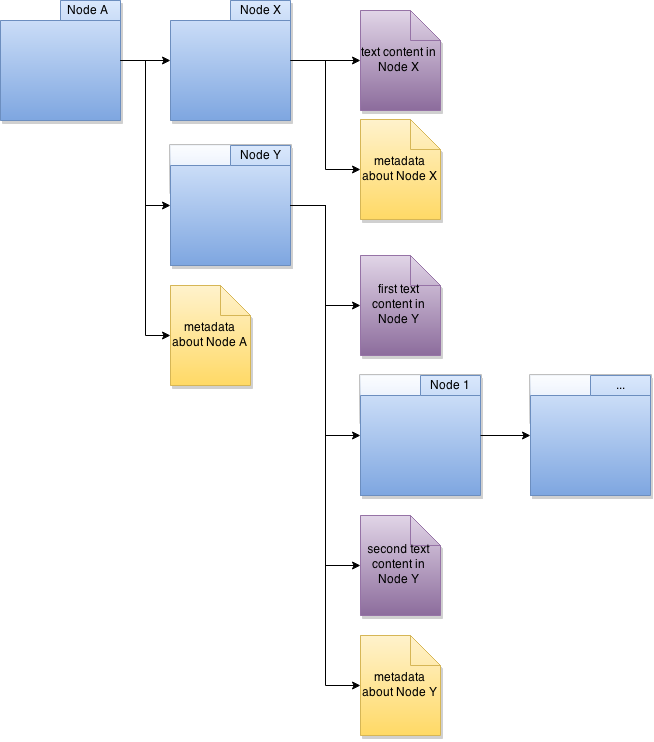

# gitlit

[]
(https://travis-ci.org/PolicyStat/gitlit)
[]
(http://gitlit.readthedocs.org/en/latest/)

This project is a collection of modules that brings the power of git to 
structured documents by students Ian Hallam, Devon Timaeus, and Sydney 
Satchwill at Rose-Hulman Institute of Technology under the leadership of
Associate Professor Sriram Mohan in addition to Wes Winham and Kyle Gibson
of PolicyStat.
	 
Currently HTML is the target language for development, with the posibility
of later including XML, DOCX, and other structure document formats.

# Getting Started

```

$ npm install gitlit

```

## Usage: gitlit [options] [command] [arguments]

### Options

* -h, (--help)         output usage information
* -V, (--version)      output the version number
* -v, (--versionFull)  Print out all the version info for the CLI
* -l, (--libraries)    Print out the versions of the libraries used

### First, create a gitlit local repo

gitlit init &lt;file&gt; &lt;outputPath&gt; &lt;repoName&gt;

```

$ gitlit init homepage.html /gitlitRepos homepage

```
   
In this case, the output path is the directory that you want the repository to
be made in. This means that for future commands that need the repository location
the repository folder, NOT THE OUTPUT DIRECTORY, needs to be given

### And change it back into html

gitlit write &lt;directory&gt; &lt;outputFile&gt;

```

$ gitlit write /gitlitRepos/homepage homepage.html

```

Note, that the output file is given as path; if the file is not given an extension (i.e. ".../example") it will
be output as HTML, but won't be that filetype.
    
### Make a new revision of the local repo given a new document

gitlit commit &lt;file to make the new revision&gt; &lt;path to repo&gt; &lt;commit message&gt;

```

$ gitlit commit homepagev2.html /gitlitRepos/homepage "My first commit"

```

### Perform a diff for the last two revisions of a repo

gitlit diff &lt;repoLocation&gt; &lt;outputLocation&gt;

```

$ gitlit commit homepagev3.html /gitlitRepos/homepage "My second commit"

$ gitlit diff /gitlitRepos/homepage /diffResources

```
In diffResources will appear an object with diff data, and css and js for an html file to be opened in a browser for a visual diff display.

# Upcoming Features
- merge
    
## por-ids : What are they?

They way that gitlit keeps track of the structure of documents for intelligent handling of
sections is via a file structure. In the Git repository that is the version control underlying the 
project, the basic file structure looks like this:


       
The idea, is that at each level, the directories and text files are given ID's that identify *what* they are.
This is useful for tracking the movement of sections even if there are small changes in their children (e.g.
text nodes). As such, the names of these directories need to be tracked, and each different element needs to
have some sort of name to be able to tell them apart.

These names are the por-ids, which are 12 byte, hex-encoded strings. The information about the order each node
is constructed is kept track of in the metadata.json files. In addition to this, the metadata.json files also
track information like the tag of the current directory, and any information like attributes. This encodes
all of the information in a simple yet robust manner.

This setup does come with a few caveats however.

## Disclaimers:
### Modifying por-ids can result in unexpected behavior
If por-ids are edited between revisions of a document, diff output can be strange, and difficult to read.
To avoid this, try not to wholesale change or delete por-ids.

### Some formatting may not be preserved
The goal of this project is to keep as much information and formatting of the file as possible.
However, unless we want to keep track of numerous files that are only whitespace, and increase 
the possibility of changes being reported by `diff`, we need to ignore some whitespace.

Currently, we are using [html](https://www.npmjs.org/package/html) for our pretty printing of output
html. Another thing to note, is that there may be closing tags on the same line as the opening tag,
this is because it is difficult know when it is alright to arbitrarily add an extra newline. So html
doesn't, it only adds the newlines when it knows for certain it is safe to.

### Missing tags (opening or closing) results in undefined behavior
If the html is missing starting or ending tags when used in any operations, then there are no 
guarantee that the interpretation of the HTML will be what the author intended. This is because
missing tags can be interpreted in many ways, so the one selected may not be what the author intended. 

To minimize this effect, be sure to include closing tags for each open tag, and vice versa.

## Libraries Used
* parse5
* html
* commander.js
* mocha
* unit.js
* deasync

## Version History
* 0.0.1
    * Basic command line tool to accept inputs
    * Help info for usage
    * Added libraries
* 0.0.2
    * Parsing of HTML files into DOM-like structure
    * Filtering of information needed for creating directory structure
    * Adding custom IDs to keep track of tags for tracking changes in sections
* 0.1.0
    * `init` feature: Creation of file directory structure mean to represent a structured document
    * Naming for each file/directory from random byte array for uniqueness
* 0.1.1
    * Parsing of File structure back into Javascript object format
    * Unit tests for `init` feature
* 0.1.2
    * Generation of HTML through reconstruction using Javascript object
    * Command-line command for this feature
* 0.2.0
    * `write` feature: Create an HTML file from the directory structure with IDs inserted into HTML
    * Unit tests for `write` feature
* 0.2.1
    * Pre tag whitespace preservation
    * Transition away from js-git to Git shell
    * Setup & teardown for directory during `commit`
* 0.2.2
    * Make Git repository commit during `commit`
    * Edge cases for `write` & `init` feature
* 0.3.0
    * `commit` feature: Given new file and a path to a repository directory, 
    create a new version of the document with a commit message
* 0.3.1
    * Updated project to be packaged on npm. Can be found [here](https://www.npmjs.org/package/gitlit)
    * Set up project to work with Travis-CI
    * Added support for comments in HTML files
    * Added support for self-closing tags
* 0.3.2
    * Added executable version for global install via npm
    * Added Vagrantfile for Vagrant development support
    * Began work on diff functionality for telling the difference between 2 revisions
* 0.4.0
    * Renamed project: psychic-octo-robot -&gt; gitlit
    * Dropped Windows support in order to keep the project working easily in Linux

## Development environment
### Docker & Vagrant
For this project, we use Docker and/or Vagrant. We chose to go for 2 different development environments since
it would get a bit more coverage for individual preferences.

Additionally, Vagrant seems to be just a bit easier if developing on Windows, since it works basically
immediately out of the box, unlike Docker for Windows.

### Docker
About Docker:

	Docker is an OS agnostic way to create an identical development environment for every member 
	on a software team. The following steps will get you set up:

### 1. Download Docker:

(in ubuntu)

    ```curl -sSL https://get.docker.io/ubuntu/ | sudo sh```

### 2. Use Docker:

(in ubuntu)

```
cd /psycho-octo-robot
sudo docker build -t="psycho-octo-robot" .
sudo docker run -i -t psycho-octo-robot
```

or to run in the background:

```sudo docker run -d psycho-octo-robot```

Docker is now running in the terminal and files can be executed within the container to have 
access to all packages needed. Further documentation can be found [here](https://docs.docker.com/userguide/)

### Vagrant
First, just install Vagrant via an [installer](https://www.vagrantup.com/downloads).

From there, when in the project directory, just run

```
vagrant up
```

The VM & Vagrant box will then provision themselves with the proper libraries and be ready for development
From there, just run `vagrant ssh` to ssh to the box for exploring the project in the environment.

Note: Vagrant syncs directories, so editing can still be done in the original directory, and Vagrant
will pick up the changes.
